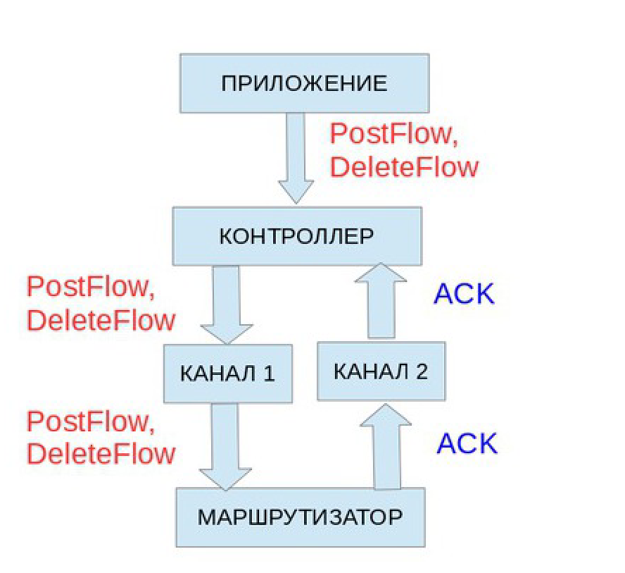
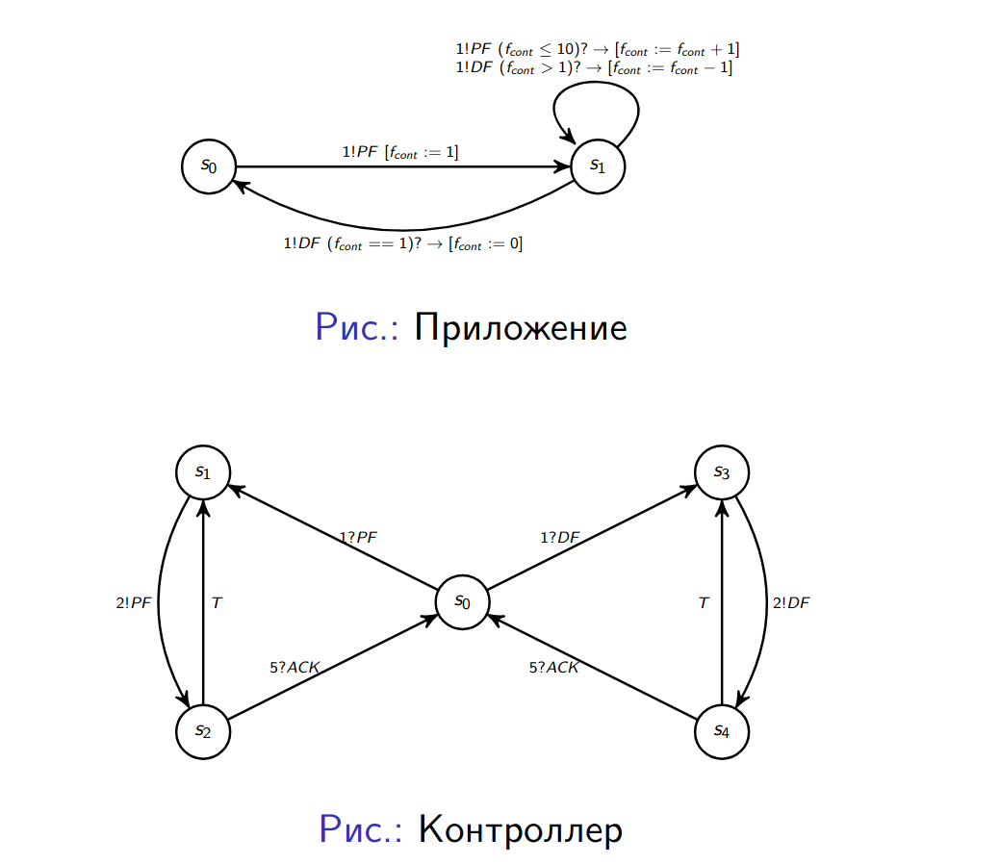
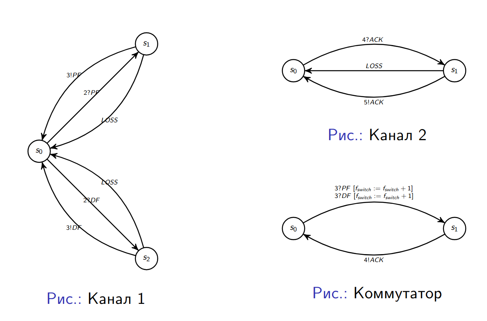

# Задача
Смоделировать поведение SDN, работающего по следующей схеме:



Поведение элементов системы описывается следующими расширенными автоматами:



Необходимо проверить, что:
- В системе отсутствуют дедлоки;
- Количество правил в коммутаторе и количество правил в коммутаторе <<с точки зрения приложения и контроллера>> должно быть неотрицательным.


# Решение
```bash
spin -a fmpi.pml
gcc -o pan pan.c
./pan -a -N allRight
./pan -a -N notNeg
```

Правило для проверки на отсутствие блокировок - `allRight`, на неотрицательность количества правил - `notNeg`.

Выполнение правила `allRight` :
```bash
error: max search depth too small
...
(Spin Version 6.5.2 -- 6 December 2019)
        + Partial Order Reduction

Full statespace search for:
        never claim             + (allRight)
        assertion violations    + (if within scope of claim)
        acceptance   cycles     + (fairness disabled)
        invalid end states      - (disabled by never claim)

State-vector 136 byte, depth reached 9999, errors: 0
 88356623 states, stored
2.7043714e+08 states, matched
3.5879376e+08 transitions (= stored+matched)
 33610254 atomic steps
hash conflicts: 1.3907794e+08 (resolved)

Stats on memory usage (in Megabytes):
13819.204       equivalent memory usage for states (stored*(State-vector + overhead))
 7535.707       actual memory usage for states (compression: 54.53%)
                state-vector as stored = 61 byte + 28 byte overhead
  512.000       memory used for hash table (-w26)
    0.534       memory used for DFS stack (-m10000)
    4.192       memory lost to fragmentation
 8044.050       total actual memory usage


unreached in proctype App
        fmpi.pml:51, state 26, "-end-"
        (1 of 26 states)
unreached in proctype Controller
        fmpi.pml:96, state 42, "-end-"
        (1 of 42 states)
unreached in proctype Channel1
        fmpi.pml:131, state 32, "-end-"
        (1 of 32 states)
unreached in proctype Channel2
        fmpi.pml:151, state 18, "-end-"
        (1 of 18 states)
unreached in proctype Switch
        fmpi.pml:173, state 21, "-end-"
        (1 of 21 states)
unreached in init
        (0 of 57 states)
unreached in claim allRight
        _spin_nvr.tmp:8, state 10, "(!(1))"
        _spin_nvr.tmp:10, state 13, "-end-"
        (2 of 13 states)

pan: elapsed time 325 seconds
pan: rate 271841.44 states/second
```
т.е. инструмент не может гарантировать, что правило не будет нарушено, т.к. превышено число состояний, которыми он может оперировать; при заданном количестве состояний нарушений не обнаруживается

  
Для правила `notNeg` найдены нарушения (правило НЕ выполнено):
```bash
(Spin Version 6.5.2 -- 6 December 2019)
Warning: Search not completed
        + Partial Order Reduction

Full statespace search for:
        never claim             + (notNeg)
        assertion violations    + (if within scope of claim)
        acceptance   cycles     + (fairness disabled)
        invalid end states      - (disabled by never claim)

State-vector 136 byte, depth reached 9999, errors: 1
 42828997 states, stored
1.3096666e+08 states, matched
1.7379565e+08 transitions (= stored+matched)
 16266793 atomic steps
hash conflicts:  67227851 (resolved)

Stats on memory usage (in Megabytes):
 6698.566       equivalent memory usage for states (stored*(State-vector + overhead))
 3710.668       actual memory usage for states (compression: 55.39%)
                state-vector as stored = 63 byte + 28 byte overhead
  512.000       memory used for hash table (-w26)
    0.534       memory used for DFS stack (-m10000)
    2.101       memory lost to fragmentation
 4221.101       total actual memory usage


pan: elapsed time 164 seconds
pan: rate 260453.64 states/second
```
